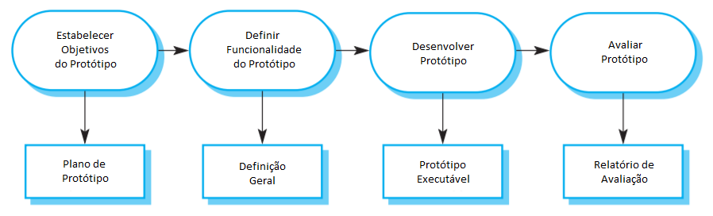

# 1 - Processos de _Software_

> Processo de _Software_ é um grupo de atividades relacionadas que levam à produção de um sistema de _Software_.

Os processos de _Software_ devem incluir, de alguma forma, as quatro atividades fundamentais da engenharia de _Software_:

1. _Especificação de Software:_ A funcionalidade do _Software_ e as restrições de sua operação devem ser definidas;
   
2. _Desenvolvimento de Software:_ O _Software_ que atende às especificações deve ser produzido;
   
3. _Validação do Software:_ O _Software_ deve ser validado para garantir que ele atenda às necessidades do cliente;
   
4. _Evolução do Software:_ O _Software_ deve evoluir para se adequar a possíveis mudanças nas necessidades do cliente.

Essas atividades são complexas e incluem subatividades, como validação de requisitos, projeto de arquitetura e testes unitários. Os processos também incluem outras atividades, como gerenciamento das configurações de _Software_ e o planejamento do projeto, que suportam as atividades de produção.

Ao se falar sobre processos, normalmente falamos sobre as atividades do processo, como especificações de modelos de dados, _design_ de UI e a priorização dessas atividades. Porém, também é importante descrever quem está envolvido, o que será produzido e as condições que influenciam a sequência das atividades:

1. _Produtos ou entregáveis_ são o retorno de uma atividade do processo. Por exemplo, o retorno da atividade de projeto de arquitetura pode ser um modelo da arquitetura do _Software_;
   
2. _Papéis_ refletem as responsabilidades das pessoas envolvidas no processo, como gerente de projeto, gerente de configurações e desenvolvedor;
   
3. _Pré e pós condições_ devem ser atendidas antes ou depois de uma atividade ser cumprida ou um produto finalizado. Por exemplo, antes de se iniciar o projeto de arquitetura, uma pré-condição pode ser que o cliente tenha aprovado todos os requisitos definidos; depois que o projeto for concluído, uma pós-condião pode ser que os modelos UML que descrevem a arquitetura tenham sido revisados.

## 1.1 - Modelos de Processo de _Software_

> Um Modelo de Processo de _Software_ (também conhecido como ciclo de vida de _Software_), é uma representação simplificada do processo de _Software_. Cada modelo representa o processo de uma perspectiva diferente e fornece informações parciais sobre o processo.

Esses modelos genéricos são descrições abstratas de alto nível dos processos de _Software_ que podem ser usadas para explicar diferentes abordagens para o desenvolvimento do _Software_, como "frameworks", que podem ser extendidos e adaptados para criar processos de engenharia de _Software_ mais específicos.

Iremos abordar os seguintes modelos gerais de processo:
1. _O Modelo Cachoeira (waterfall):_ As atividades fundamentais de especificação, desenvolvimento, validação e evolução do processo são representadas como fases separadas, como especificação de requisitos, projeto de _Software_, implementação e testes;
   
2. _Desenvolvimento Incremental:_ Esta abordagem intercala as atividades de especificação, desenvolvimento e validação. O sistema é desenvolvido como uma série de versões (incrementos), com cada versão adicionando funcionalidades à anterior;
   
3. _Integração e Configuração:_ Este modelo conta com a disponibilidade de componentes ou sistemas reusáveis. O processo de desenvolvimento do sistema foca na configuração desses componentes para uso em um novo cenário e para integrá-los em um novo sistema.

### 1.1.1 - O Modelo Cachoeira (_Waterfall_)

>O modelo cachoeira foi o primeiro modelo de processo de desenvolvimento de _Software_ publicado. Ele representa o processo de desenvolvimento de _Software_ como um número de estágios (Figura 1.1).

<figure class="center" style="text-align:center">
  
  <figcaption><i>Figura 1.1 - Modelo Cachoeira</i></figcaption>
</figure>

Pelo efeito cascata de uma fase a outra, este modelo é conhecido como Modelo Cachoeira, ou Ciclo de Vida de _Software_. Ele é um exemplo de processo orientado a planejamento. A princípio, deve-se planejar e programar todas as atividades do processo antes de se iniciar seu desenvolvimento.

Os estágios do modelo Cachoeira refletem diretamente as atividades fundamentais de desenvolvimento de _Software_:

1. _Análise e Definição de Requisitos:_ Os serviços, restrições e metas do sistema são estabelecidos em conjunto com os usuários do sistema. Eles são definidos em detalhes e servem como especificação do sistema;
   
2. _Definição de Sistema e Software:_ O processo de _design_ de sistemas abrange requisitos de _Hardware_ e _Software_. Ele estabelece um sistema geral de arquitetura. _design_ de _Software_ envolve identificar e descrever as abstrações fundamentais do sistema e seus relacionamentos;
   
3. _Implementação e Testes Unitários:_ Durante este estágio, o _design_ de _Software_ acontece como um conjunto de programas ou unidades. Testes Unitários envolvem verificar que cada unidade atende às especificações;

4. _Integração e Testes de Sistema:_ As unidades criadas são integradas e testadas como um sistema completo para garantir que os requisitos do _Software_ foram cumpridos. Depois dos testes, o sistema é entregado ao cliente;

5. _Operação e Manutenção:_ Normalmente esta é a fase mais longa do ciclo de vida. O sistema é instalado e colocado pra uso. A manutenção envolve corrigir erros que não foram descobertos em estágios anteriores, aprimorando a implementação das unidades do sistema e melhorando os serviços conforme novos requisitos são descobertos.

A princípio, o resultado de cada fase da cascata é a aprovação de um ou mais documentos. Cada fase só se inicia quando a anterior é concluída e aprovada. Porém, o desenvolvimento de _Software_ raramente se dá de forma linear. É comum que cada fase se comunicam e se sobrepõe conforme necessário. Com novas informações surgindo em cada estágio, os documentos aprovados anteriormente devem ser atualizados para identificar as mudanças necessárias.

### 1.1.2 - Desenvolvimento Incremental

> Desenvolvimento Incremental se baseia na ideia de desenvolver uma implementação inicial, receber _feedback_ de usuários, e evoluir o _Software_ por meio de versões até que o sistema requerido seja apresentado (Figura 1.2). Atividades de especificação, desenvolvimento e validação são intercaladas com rápido _feedback_ entre elas.

<figure class="center" style="text-align:center">
  
  <figcaption><i>Figura 1.2 - Desenvolvimento Incremental</i></figcaption>
</figure>

De certa forma, o Desenvolvimento Incremental é hoje a abordagem mais utilizada para desenvolvimento de aplicações e produtos de _Software_. Ela pode se dar de forma ágil, orientada a planos ou, mais usualmente, uma mistura dos dois.

Essa perspectiva é muito utilizada pois raramente é possível definir previamente uma solução completa para um dado problema. Desenvolver por etapas, adaptando a demanda de acordo com a necessidade, torna o desenvolvimento mais barato e mais simples de manter.

Cada incremento ou versão do sistema incorpora algumas funcionalidades solicitadas pelo cliente. Geralmente, os primeiros incrementos do sistema incluem as funcionalidades mais importantes ou urgentes. Isso significa que o cliente ou usuário pode avaliar o sistema nos seus estágios iniciais de desenvolvimento. Caso os requisitos solicitados não estejam sendo atendidos como deveriam, apenas o incremento atual precisa ser modificado e, possivelmente, novas funcionalidades podem ser definidas para incrementos posteriores.

O Desenvolvimento Incremental tem três vantagens principais sobre o Modelo Cachoeira:

1. _O custo dos requisitos de implementação é reduzido._ A quantidade de análises e documentação que precisa ser refeita é significativamente menor;

2. _É mais fácil de receber _feedback_ do cliente com o trabalho em andamento._ Clientes podem comentar em demonstrações do _Software_ e ver quanto já foi implementado, ao invés de julgar o processo por documentos de _design_ de _Software_;

3. _Entregas e implantações antecipadas são possíveis, mesmo que nem todas as funcionalidades estejam concluídas._ É possível que o cliente use e agregue valor ao _Software_ antes da sua conclusão.

Do ponto de vista gerencial, a abordagem Incremental apresenta dois problemas:

1. _O processo não é visível._ Gerentes precisam de entregas regulares para medir progresso. Se o sistema é desenvolvido rápido, o custo para produzir documentação que reflita com detalhes cada versão do sistema acaba se elevando;
   
2. _A estrutura do sistema tende a se comprometer com a adição de novos incrementos._ Mudanças regulares lvam a código desorganizado com novas funcionalidades sendo adicionadas sem tanto controle. Se torna difícil e custoso adicionar novas características ao sistema. Para reduzir a degradação estrutural e desorganização de código, métodos ágeis sugerem refatoração regular do _Software_.

### 1.1.3 - Integração e Configuração

Na maioria dos projetos de _Software_ há reuso. Isso normalmente acontece de forma informal, quando desenvolvedores conhecem ou pesquisam código similar ao requerido. Tal código é modificado e integrado de acordo com as necessidades.

Três tipos de componentes de _Software_ são comumente reutilizados:

1. _Aplicações stand-alone (autônomas) configuradas para uso em um ambiente específico._ Estes sistemas são de uso geral e possuem diversas características, mas devem ser adaptados para uso em aplicações específicas;
   
2. _Coleções_ de objetos desenvolvimento como componentes ou pacotes a serem integrados com um _framework_, como por exemplo o _Java Spring Framework_;
   
3. _Web Services_ desenvolvidos de acordo com padrões de serviço e que estão disponíveis para serem chamados pela Internet.

<figure class="center" style="text-align:center">
  
  <figcaption><i>Figura 1.3 - Engenharia de Software Orientada a Reuso</i></figcaption>
</figure>

A Figura 1.3 mostra um modelo de processo geral para desenvolvimento orientado a reuso, baseado em integração e configuração. Os estágios do processo são:

1. _Especificação de Requisitos:_ Os requisitos iniciais do sistemasão propostos. Eles não precisam ser elaborados em detalhe mas devem incluir descrições breves dos requisitos essenciais e características específicas do sistema;
   
2. _Descoberta e Validação de Software:_ A partir de uma visão geral dos requisitos do _Software_, é feita uma pesquisa por componentes e sistemas com as funcionalidades requeridas. Os componentes e sistemas selecionados são avaliados quanto aos requisitos essenciais e quanto à adequação geral para uso no sistema;
   
3. _Refinamento dos Requisitos:_ Nesta etapa os requisitos são refinados usando informação dos componentes e aplicações descobertas. Os requisitos são adaptados aos componentes disponíveis e as especificações de sistema são redefinidas. Quando modificações não forem possíveis, a atividade de análise de componente deve voltar à busca de soluções alternativas;
   
4. _Configuração do Sistema de Aplicação:_ Se uma solução selecionada cumpre todos os requisitos, ela deve então ser configurada para uso no sistema a ser criado;
   
5. _Adaptação e Integração de Componentes:_ Se não há solução que preencha todos os requisitos, deve-se modificar componentes reutilizáveis ou criar novos, para então integrá-los ao sistema.

Engenharia de _Software_ Orientada a reuso, baseada em configuração e integração, tem a vantagem clara de reduzir a quantidade de _Software_ desenvolvido e reduzir custos e riscos. Geralmente esta abordagem também leva a entrega rápida de _Software_, porém os requisitos podem ser comprometidos. Além disso, pode-se perder controle da evolução do sistema quando novas versões dos componentes reusáveis não estão sob controle da organização que os usa.

## 1.2 - Atividades do Processo

As quatro atividades do processo de _Software_ são especificação, desenvolvimento, validação e evolução. Elas são organizadas de acordo com o processo de selecionado. Por exemplo, no modelo cachoeira, elas são organizadas em sequência, enquanto no desenvolvimento incremental, são intercaladas. A definição dessa organização depende do tipo de _Software_ desenvolvido, da experiência e competência dos desenvolvedores e do tipo de empresa desenvolvendo o sistema.

### 1.2.1 - Especificação de _Software_

> Especificação de _Software_ ou Engenharia de Requisitos é o processo de entender e definir quais serviços são necessários para o sistema e identificar as restrições de operação e desenvolvimento do mesmo.

<figure class="center" style="text-align:center">
  
  <figcaption><i>Figura 1.4 - Processo de Engenharia de Requisitos</i></figcaption>
</figure>

O processo de Engenharia de Requisitos (Figura 1.4) visa produzir um Documento de Requisitos que especifica um sistema que atende às demandas das partes interessadas. Normalmente os requisitos são apresentados em dois níveis de detalhe. Para usuários e clientes, é comum que se apresente um documento com maior nível de abstração, enquanto desenvolvedores precisam de especificações mais detalhadas do sistema.

Existem três atividades principais no processo de Engenharia de Requisitos:

1. _Criação e Análise de Requisitos:_ Processo de definir os requisitos do sistema a partir de observação de sistemas existentes, conversas com usuários e clientes, análises de necessidades, etc. Esta etapa pode envolver a criação de modelos e protótipos, e ajuda no entendimento do sistema especificado;
   
2. _Especificação de Requisitos:_ Esta etapa consiste em reunir as informações colhidas na Análise de Requisitos em um documento. Dois tipos de requisitos serão definidos neste documento. Requisitos de usuário são abstratos para melhor compreensão do cliente e usuário final; requisitos de sistema devem descrever suas funcionalidades de forma detalhada;
   
3. _Validação de Requisitos:_ Checagem dos requisitos pela consistência, realismo e completude. Este processo encontra e corrige erros no Documento de Requisitos.

Em métodos ágeis, a especificação de requisitos não é uma atividade separada, mas parte do desenvolvimento do sistema. Requisitos são especificados informalmentepara cada incremento do sistema, logo antes do seu desenvolvimento, geralmente por parte dos usuários que trabalham junto aos desenvolvedores no processo.

### 1.2.2 - _Design_ e Implementação de _Software_

> Dependendo da abordagem selecionada para o projeto, Desenvolvimento e _Design_ são atividades que podem ser intercaladas. Abordagens mais ágeis geralmente envolvem menor registro de _design_, uma vez que ele é feito durante o processo de desenvolvimento.

A Figura 1.5 mostra um modelo abstrato de processo de _design_, que mostra suas entradas, atividades e saídas. As atividades do processo são ambas intercaladas e interdependentes. Retrabalho de _design_ é inevitável, uma vez que novas informações são geradas constantemente.

<figure class="center" style="text-align:center">
  
  <figcaption><i>Figura 1.5 - Um Modelo Geral do Processo de Design</i></figcaption>
</figure>

As atividades no processo de _design_ variam, dependendo do tipo de sistema sendo desenvolvido. Por exemplo, sistemas em tempo real requerem um estágio adicional de sincronismo, mas podem não necessitar de banco de dados, então as atividades devem ser adaptadas. A Figura 1.5 mostra quatro atividades que podem ser parte de um processo de _design_ para sistemas de informação:

1. _Design de Arquitetura:_ Onde a estrutura geral do sistema será identificada. Seus componentes, seus relacionamentos e como são distribuídos;

2. _Design de Banco de Dados:_ Quando são definidas as estruturas de dados do sistema e como elas serão representadas no banco de dados. Este trabalho depende da fonte dos dados, se serão criados ou reutilizados;

3. _Design de Interface:_ Definição das interfaces entre os componentes. Estas definições não podem ser ambíguas. Os componentes devem ser usados por outros sem que seja necessário conhecer sua implementação. Com essas definições precisas, é possível desenvolver cada componente de forma independente;

4. _Design e Seleção de Componentes:_ É quando componentes reutilizáveis devem ser selecionados e, nos casos onde não houver, novos deverão ser desenvolvidos. O _design_ deve se preocupar com uma simples descrição do componente e os detalhes de implementação devem ser deixados para o programador.

### 1.2.3 Validação de _Software_

> A Validação de _Software_ visa checar se um sistema acata as especificações e atinge as expectativas do cliente.

A principal técnica de validação utilizada é o teste com dados simulados. Os principais estágios de teste são:

1. _Testes de Componentes:_ Os componentes do sistema são testados pelos desenvolvedores. Cada componente é testado individualmente, e podem ser funções, classes ou agrupamentos destas entidades. Ferramentas de automação de testes, que rodam sempre que novas versões do componente são criadas, são comumente usadas;
   
2. _Testes de Sistema:_ Esta etapa se preocupa com erros imprevistos na integração entre os componentes que formam o sistema. Também entra nesta etapa a adequação do sistema com os requisitos definidos (funcionais ou não), e testar futuras propriedades do sistema;
   
3. _Testes de cliente:_ Esta é a etapa final do processo de teste, antes do sistema ser aceito para uso operacional. O usuário final deverá testar o sistema com dados reais. Problemas de requisitos, funcionalidades e performance devem ser encontrados aqui.

Se uma abordagem incremental estiver sendo usada, cada incremento deve ser testado conforme for desenvolvido, com testes baseados nos requisitos daquele incremento. No desenvolvimento orientado a testes, que geralmente acontece em desenvolvimento ágil, os testes são definidos e desenvolvidos com os requisitos antes do início do desenvolvimento.

Ao se usar um processo de _Software_ orientado a planos, os testes são guiados por grupos de planos de teste. A Figura 1.6 mostra como planos de testes funcionam como ligação entre as atividades de teste e desenvolvimento.

<figure class="center" style="text-align:center">
  
  <figcaption><i>Figura 1.6 - Fases de Teste em Processo de Software Orientado a Planos</i></figcaption>
</figure>

## 1.3 - Lidando com Mudanças

Mudanças aumentam os custos de desenvolvimento do _Software_, pois geralmente elas significam que trabalho que já foi concluído precisa ser refeito. Isso é chamado de retrabalho. Por exemplo, se os relacionamentos entre os requisitos em um sistema são analisados criando novos requisitos, algumas ou todas as análises de requisitos devem ser repetidas. Pode ser necessário refazer o _design_ do sistema para entregar os novos requisitos, alterar programas já finalizados e retestar o sistema.

Duas abordagens relacionadas devem ser usadas para reduzir os custos de retrabalho:

1. _Antecipação:_ O Processo de _Software_ inclui atividades que antecipam ou preveem possível mudanças antes que retrabalho significante seja necessário. Como por exemplo o uso de protótipos;

2. _Tolerância:_ Quando o processo e o _Software_ são pensados de forma a facilitar que mudanças sejam feitas. Isso geralmente envolve desenvolvimento incremental, onde apenas pequenas partes do código serão alteradas por vez.

### 1.3.1 - Prototipagem

> Um protótipo é uma versão inicial do sistema usado para demonstrar conceitos, testar decisões de _design_, e entender melhor o problema e suas possíveis soluções.

É importante que os protótipos sejam desenvolvidos de forma rápida e iterativa para que os custos sejam controlados e as partes interessadas possam experimentá-lo nas fases iniciais de desenvolvimento.

Um protótipo de _Software_ pode ser usado no processo de desenvolvimento para ajudar a antecipar mudanças que podem ser necessárias:

1. No processo de engenharia de requisitos, um protótipo pode ajudar a criar e validar requisitos de sistema;
   
2. No processo de _design_ do sistema, um protótipo pode ser usado para explorar soluções e no desenvolvimento de uma interface pro sistema.

Protótipos permitem que usuários avaliem o funcionamento do sistema. Eles podem encontrar novas ideias de requisitos, bem como pontos positivos e negativos da implementação. Também é comum que clientes entendam erros de especificação e funcionalidades solicitadas.

<figure class="center" style="text-align:center">
    
    <figcaption><i>Figura 1.7 - Desenvolvimento de Protótipo</i></figcaption>
</figure>

A Figura 1.7 mostra um modelo de processo para desenvolvimento de protótipo.Os objetivos do protótipo devem estar explícitos desde o início do processo.

O próximo passo no processo é decidir o que colocar e o que deve ser deixado de fora, para reduzir custos e acelerar o processo de entrega.

A etapa final do processo é a avaliação. Usuários em potencial precisam de tempo para se acostumar com o novo sistema e se adequar aos novos padrões de uso. Quando eles estão usando normalmente o sistema, podem encontrar requisitos errados ou omitidos. 

### 1.3.2 - Entrega Incremental

Entrega Incremental (Figura 1.8) é uma abordagem de desenvolvimento de _Software_ onde incrementos são desenvolvidos e entregues aos cliente, sendo implantadas para uso no ambiente de trabalho.

<figure class="center" style="text-align:center">
    
    <figcaption><i>Figura 1.8 - Entrega Incremental</i></figcaption>
</figure>

Num processo de entrega incremental, os clientes definem quais serviços são os mais importantes. Então um número de incrementos é definido, com cada um deles fornecendo um subgrupo de funcionalidades do sistema. A alocação de serviços por incremento depende da prioridade de cada serviço. Quanto maior a prioridade, mais cedo se entrega o serviço.

Uma vez que os incrementos são identificados, os requisitos dos sistema a serem entregues no primeiro incremento são definidos em detalhe para que se inicie a implementação. Durante o desenvolvimento, novas análises de requisitos são realizadas para que futuros incrementos sejam definidos, porém mudanças nos requisitos em desenvolvimento não são aceitas.

Uma vez que o incremento está completo e entregue, deve ser implentado para uso no ambiente de trabalho. Assim ele poderá ser experimentado, ajudando a visualizar melhor os requisitos para novos incrementos. A medida que novos incrementos são desenvolvidos, eles são integrados com os já existentes para que as funcionalidades do sistema cresçam com cada etapa.

A entrega incremental tem um número de vantagens:

1. clientes podem usar os incrementos iniciais como protótipos e adquirir experiência nos requisitos para os próximos incrementos. Diferente dos protótipos, os incrementos são partes do sistema real, então não há reaprendizado depois que o sistema está concluído;

2. Clientes não precisam esperar até que o sistema completo seja entregue para começar a avaliá-lo. O primeiro incremento satisfaz seus requisitos mais críticos, então eles podem usar o _Software_ imediatamente;

3. Um dos benefícios do desenvolvimento incremental mantidos no processo é o de ser relativamente fácil incoporar mudanças no sistema;
   
4. Como os serviços de maior prioridade são entregues primeiro, os serviços mais críticos são mais testados. Então os clientes provavelmente encontrarão com menor frequência erros nas partes mais importantes do sistema.

Porém, há problemas com a Entrega Incremental. Na prática, ele apenas funciona onde um sistema novo está sendo introduzido e seus avaliadores têm tempo disponível para experimentá-lo. Problemas chaves da abordagem são:

1. A entrega iterativa se torna complicada quando o novo sistema tem a intenção de substituir um já existente. Os usuários precisam de todas as funcionalidades do antigo sistema e geralmente não estão dispostos a experimentar com um novo sistema ainda incompleto. Geralmente é impraticável usar o novo sistema junto ao anterior, uma vez que eles podem usar bases de dados e interfaces diferentes;

2. A maioria dos sistemas requerem um grupo de fundamentos básicos para seu funcionamento que são usados em diferentes partes do mesmo. Como os requisitos não estão definidos em detalhe até que cada incremento esteja para ser implementado, pode ser difícil identificar fundamentos comuns que serão necessários para todos ou vários incrementos;

3. A essência dos processos iterativos é que a especificação é desenvolvida junto com o _Software_. Porém, isso conflita com o modelo de aquisição da maioria das empresas, onde geralmente a especificação completa do sistema é parte do contrato de desenvolvimento do sistema. Na abordagem incremental, não há especificação completa do sistema até que seu último incremento seja especificado. Isso requer um novo modelo de contrato, onde grandes clientes, como agências governamentais, podem encontrar dificuldades para se encaixar.

Modelos de entrega e desenvolvimento incrementais podem não se adequar a certos tipos de _Software_. Por exemplo, sistemas muito grandes, onde equipes diferentes trabalham individualmente, alguns sistemas embarcados, que o desenvolvimento de _Hardware_ e _Software_ ocorrem de forma interdependente, e alguns sistemas críticos, onde todos os requisitos devem ser analisados para checar suas interações que podem comprometer sua segurança e confiabilidade.

Esses sistemas sofrem com problemas deincerteza e mudanças de requisitos. Portanto, para contornar esses problemas e aproveitar alguns benefícios do desenvolvimento incremental, protótipos do sistema podem ser desenvolvidos e usados como plataforma de experimentação dos requisitos e _design_ do sistema. Com a experiência adquirida pelos protótipos, requisitos definitivos podem ser escolhidos.

## 1.4 - Melhorias de Processo

Atualmente existe uma crescente demanda da indústria por _Softwares_ melhores, mais baratos e que devem ser entregues com _deadlines_ cada vez mais apertadas. Consequentemente, muitas empresas de _Software_ estão adotando Melhorias de Processo como forma de aumentar a qualidade dos seus sistemas, reduzir custos, e/ou acelerar seu desenvolvimento. Melhorias de Processo envolvem conhecer processos existentes e alterá-los para melhorar a qualidade do produto e/ou reduzir seus custos e tempo de produção.

Duas abordagens principais de melhoria e mudança de processos são usadas:

1. _A Abordagem de Maturidade_ do processo, que foca em melhorar o processo e o gerenciamento do projeto, e introduzir boas práticas de engenharia de _Software_ na companhia. O nível de maturidade do processo reflete o alcance de quais boas práticas técnicas e de gerenciamento adotadas nos processos organizacionais de desenvolvimento do _Software_. As metas principais desta abordagem são melhorar a qualidade do produto e a previsibilidade do processo;

2. _A Abordagem Ágil_, que foca no desenvolvimento iterativo e na redução de sobrecarga no processo de _Software_. As características primárias dos métodos de desenvolvimento ágil são entregas rápidas de funcionalidades e responsividade a mudanças nos requisitos do cliente. A filosofia de melhoramento aqui é que os melhores processos são aqueles com menor sobrecarga.

Entusiastas de cada uma destas abordagens costumam ser céticos quanto aos benefícios da outra. A abordagem de maturidade do processo é baseada no desenvolvimento orientado a planos e geralmente requer sobrecarga crescente, no sentido de que as atividades introduzidas não são necessariamente diretamente relevantes no desenvolvimento. Abordagens ágeis focam no código sendo desenvolvido e minimizam deliberadamente formalidades e documentação.

O método geral de melhoria de processo implícito na abordagem de maturidade é um método cíclico. Suas etapas são:

1. _Medições do Processo:_ Deve-se quantizar um ou mais atributos do processo de _Software_ ou produto. Estas medidas formam uma base que ajuda a decidir se as melhorias de processo foram efetivas. Conforme melhorias são adicionadas, é necessário medir os mesmos atributos. É esperados que eles tenham melhorado de alguma forma;

2. _Análise do Processo:_ O processo é avaliado, então suas fraquezas e gargalos são identificados. Modelos de processo (também chamados de mapas de processo) devem ser desenvolvidos nesta etapa. A análise deve focar em considerar características do processo, como velocidade e robustez;

3. _Mudanças no Processo:_ Alterações são então propostas para endereçar algumas das fraquezas do processo. Elas são introduzidas e o ciclo prossegue com a coleta de dados sobre a eficiência das mudanças.

Sem dados concretos do processo ou do _Software_ desenvolvido pelo mesmo, é impossível avaliar as melhorias no processo. Contudo, empresas que estão começando a melhorar seus processos dificilmente terão dados disponíveis como uma base de melhoria. Portanto, como parte do primeiro ciclo de mudanças, deve-se coletar dados sobre o processo de _Software_ e sobre as características do produto.

Melhorias de processo são uma atividade de longo prazo, onde cada etapa pode durar meses. Também é uma atividade contínua, já que para quaisquer novos processos introduzidos ou alterados, o ambiente de negócio vai mudar e os próprios processos deverão evoluir para aderir às novas definições.

No passar de 25 anos desde a concepção do primeiro método de melhoria de processo, cinco níveis de maturidade de processo foram propostos, mantendo as ideias fundamentais dos primeiros modelos de avaliação de maturidade de sistemas. Estes níveis são:

1. _Inicial:_ As metas associadas ao processo são satisfeitas, e para todos os processos o escopo de trabalho a ser realizado é explicitamente definido e comunicado aos membros da equipe;

2. _Gerenciado:_ Neste nível, as metas associadas ao processo são atingidas, e políticas organizacionais definem quando cada processo deve ser usado. Devem haver planos de projeto documentados que definam estas metas. Gerenciamento de recursos e monitoramento de procedimentos devem estar sendo aplicados;

3. _Definido:_ Este nível foca em padronização organizacional e implantação de processos. Cada projeto tem um processo gerenciado que se adapta aos seus requisitos a partir de um grupo de processos organizacionais predefinidos. Avaliações e medições sobre o processo devem ser coletadas e usadas em futuras melhorias;

4. _Gerenciado Quantitativamente:_ Neste nível, existe a responsabilidade organizacional de usar métodos estatísticos e outros métodos quantitativos para controlar subprocessos. Ou seja, medidas de processo e produto devem ser usadas no gerenciamento dos processos;

5. _Otimizando:_ No nível mais alto, a equipe deve usar as medidas de processo e produto coletadas para guiar as melhorias de processo. Tendências devem ser analizadas e os processos adaptados às necessidades de mudanças de negócio.

O trabalho em níveis de maturidade têm grande impacto na indústria de _Software_. Ele foca sua atenção nos processos e práticas de Engenharia de Software usadas e leva a mudanças significantes em suas capacidades. Porém, há muita sobrecarga nos processos formais de melhoria em pequenas empresas, e estimar melhorias em processos ágeis é difícil. Consequentemente, é comum que apenas grandes companhias de _Software_ usem esta abordagem focada em maturidade.

>## Pontos Chave do Capítulo
>
>* Processos de _Software_ são as atividades envolvidas na produção de um sistema de _Software_;
>  
>* Modelos de processo genéricos descrevem a organização dos processos de _Software_. Exemplos destes modelos incluem o modelo _waterfall_, desenvolvimento incremental, e a configuração e integração de componentes reusáveis;
>
>* Engenharia de requisitos é o processo de desenvolver especificações de _Software_. Especificações têm a intenção de comunicar as necessidades do cliente pro sistema aos desenvolvedores;
>
>* Processos de _design_ e implementação visam transformar uma especificação de requisito em um sistema executável de _Software_;
>
>* Validação de _Software_ é o processo de checar que o sistema atende às especificações e às reais necessidades dos usuários do sistema;
>
>* A Evolução de _Software_ se inicia quando um _Software_ já existente é alterado para atender novos requisitos. Mudanças são contínuas e o _Software_ deve evoluir para se manter útil;
>
>* Processos devem incluir atividades para lidar com alterações. Isso pode envolver uma fase de prototipagem que evita más decisões de requisitos e _design_;
>
>* Melhorias de Processo existem para melhorar processos de _Software_, para melhorar a qualidade do _Software_, reduzir seus custos de produção ou reduzir tempo de desenvolvimento. É um processo cíclico que envolve medições, análises e mudanças.

# 2 - Engenharia de Requisitos

> Os requisitos de um sistema são as descrições dos serviços que o sistema deve proporcionar e as restrições de sua operação. O processo de descobrimento, análise, documentação e checagem desses serviços e restrições e chamado Engenharia de Requisitos.

O termo _requisito_ não é usado com consistência na indústria de _Software_. Em alguns casos ele é uma simples descrição abstrata e de alto nível do serviço ou restrição que o sistema deve possuir, e em outros casos ele é uma definição detalhada e formal de uma funcionalidade do sistema. Isso acontece para atender às espectativas de diferentes clientes e usuários. Por exemplo, um contratante precisa de um nível de abstração maior, enquanto um desenvolvedor precisa de mais detalhamento.

Alguns problemas que surgem no processo de Engenharia de _Software_ são resultados da má separação entre esses diferentes níveis de descrição. É comum separar os termos entre _requisitos de usuário_, para os requisitos mais abstratos, e _requisitos de sistema_, para os mais detalhados que dizem o que o sistema deve fazer. Estes termos podem ser definidos como:

1. _Requisitos de Usuário:_ são explicações, em linguagem natural e/ou diagramas, dos serviços que o sistema deve fornecer aos usuários, e as restrições de operação dos mesmos. Podendo ser descrições abrangentes ou detalhadas das funcionalidades requeridas;

2. _Requisitos de Sistema:_ São descrições mais detalhadas das funções, serviços e restrições operacionais do sistema. O documento de requisitos do sistema (também chamado de especificação funcional) deve definir exatamente o que será implementado. Podendo ser parte do contrato do sistema.

Diferentes tipos de requisitos são necessários para comunicar informações sobre o sistema para diferentes tipos de leitor. A Tabela 2.1 mostra a diferenciação entre os requisitos de usuário e de sistema. Este exemplo mostra como um requisito de usuário pode ser expandido em vários requisitos de sistema. Podemos ver que, neste caso, o requisito de usuário é bem mais geral. Os requisitos de sistema fornecem informações mais detalhadas sobre os serviços e funções que devem ser implementadas no sistema.

<table class="tg center">
  <caption>Tabela 2.1 - Requisitos de Usuário e de Sistema</caption>
  <thead>
    <tr>
      <th class="tg-lt">Requisitos de Usuário</th>
      <th class="tg-lt">Requisitos de Sistema</th>
    </tr>
  </thead>
  <tbody>
    <tr>
      <td class="tg-lm" rowspan="5">O sistema deve gerar relatórios mensais mostrando os custos dos medicamentos prescritos por cada clínica.</td>
      <td class="tg-lt">No último dia útil de cada mês, deve ser gerada uma lista dos medicamentos prescritos, com seus custos e as clínicas que os prescreveu.</td>
    </tr>
    <tr>
      <td class="tg-lt">O sistema deve gerar o relatório para impressão até 17h30 no último dia útil do mês.</td>
    </tr>
    <tr>
      <td class="tg-lt">Um relatório deve ser criado para cada clínica e deve listar os nomes dos medicamentos, o número total de prescrições, as doses prescritas e o custo total dos medicamentos prescritos.</td>
    </tr>
    <tr>
      <td class="tg-lt">Se os medicamento tiverem diferentes unidades de dose (10mg, 20mg, etc.) relatórios diferentes devem ser criados.</td>
    </tr>
    <tr>
      <td class="tg-lt">O acesso aos relatórios de custo dos medicamentos deve ser restrito a usuários autorizados de acordo com uma lista de controle de acesso.</td>
    </tr>
  </tbody>
</table>

É necessário escrever requisitos em diferentes níveis de detalhe para que usuários diferentes possam usar o documento de requisitos de acordo com a necessidade. Os leitores dos requisitos de usuário geralmente não estão preocupados com o funcionamento interno do sistema, como usuários finais ou clientes. Já os leitores dos requisitos de sistema, precisam saber exatamente o que o sistema fará, pois estão interessados nos processos de negócio, ou estão envolvidos com o desenvolvimento.

Normalmente a Engenharia de Requisitos é apresentada como primeira etapa do processo de Engenharia de _Software_. Porém, é necessário o conhecimento de alguns requisitos antes da aquisição ou desenvolvimento do sistema.

No momento estudaremos uma abordagem mais "tradicional" dos requisitos, em comparação com processos ágeis, que serão abordados no próximo capítulo. Na maioria dos grandes sistemas, é necessário manter uma fase claramente distinta de engenharia de requisitos antes de qualquer implementação. O resultado desta fase é um documento de requisito, que pode ser parte do contrato do sistema.

## 2.1 - Requisitos Funcionais e Não Funcionais

Requisitos de sistema de _Software_ geralmente são classificados como Funcionais ou Não Funcionais:

1. _Requisitos Funcionais:_ São discriminações dos serviços que o sistema deve prover,como ele deve reagir a determinadas interações e como deve se comportar em situações expecíficas. Em alguns casos, os Requisitos Funcionais também explicitam o que o sistema não deve fazer;

2. _Requisitos Não Funcionais:_ São restrições nas funções ou serviços oferecidos pelo sistema. Elas podem ser relacionadas ao tempo (cronograma), ao processo de desenvolvimento, a padrões, etc. Normalmente, Requisitos Não Funcionais se aplicam ao sistema como um todo ao invés de recursos ou serviços específicos.

Os requisitos de sistema são interdependentes e podem gerar restrições ou até outros requisitos. Portanto, eles não apenas definem os serviços e propriedades requeridas ao sistema; eles também especificam as funcionalidades necessárias para que estes serviços/propriedades sejam entregues efetivamente.

### 2.1.1 - Requisitos Funcionais

> Os Requisitos Funcionais de um sistema descrevem o que o sistema deve fazer. E dependem do tipo de _Software_ sendo desenvolvido, os usuários potenciais e a abordagem geral da organização para escrevê-los.

Requisitos Funcionais podem variar em detalhe. Eles podem ser descrições gerais sobre o que o sistema deve fazer, a descrições mais específicas do funcionamento esperado.

Imprecisões na especificação dos requisitos pode levar a desentendimentos entre clientes e desenvolvedores. É natural que um desenvolvedor interprete um requisito ambíguo da maneira que simplifique sua implementação. Idealmente, as especificações de requisitos devem ser completas e consistentes. Por completude, significa dizer que é necessário que todos os serviços e informações necessários pelo usuário devem ser definidos. Consistência significa dizer que nenhum requisito especificado pode ser ambíguo ou contraditório.

Na prática, só é possível alcançar consistência e completude em sistemas pequenos. É muito comum que ocorram erros ou omissões ao se escrever requisitos para sistemas grandes e complexos. Alé disso, grandes sistemas costumam ter várias partes interessadas, com diferentes _backgrounds_ e expectativas. É comum que essas partes tenham necessidades diferentes, e muitas vezes inconsistentes entre elas. Tais inconsistências podem não ser óbvias e passarem despercebidas na etapa de concepção dos requisitos, sendo descobertas após análise mais detalhada ou mesmo durante o desenvolvimento do sistema.

### 2.1.2 - Requisitos Não Funcionais

> Requisitos Não Funcionais não se preocupam diretamente com serviços específicos fornecidos pelo sistema aos usuários. Eles geralmente especificam ou restringem características do sistema como um todo. Podendo se relacionar com propriedades do sistema, como confiabilidade, tempo de resposta e uso de memória, ou até mesmo restrições de implementação, como capacidades de entrada e saída, representações de dados e interfaces para interação com outros sistemas.

Requisitos não funcionais podem afetar a arquitetura de um _Software_ no geral, sendo deste modo implementados por todo o sistema, não sendo tão simples identificar em que lugar do código deve ser implementado. Eles podem também gerar requisitos funcionais relacionados, por exemplo, um requisito de segurança pode necessitar de novos serviços e até mesmo restrições de acesso no sistema.

Sempre que possível, os requisitos não funcionais devem ser preferencialmente quantizáveis, para que possam ser testado objetivamente. A Tabela 2.2 mostra medições que podem ser adotadas em propriedades não funcionais. Você pode validar seus valores nas etapas de teste para checar os requisitos atingidos.

<table class="tg center">
  <caption>Tabela 2.2 - Medidas de Especificação de Requisitos Não Funcionais</caption>
  <thead>
    <tr>
      <th class="tg-lt">Propriedades</th>
      <th class="tg-lt">Medidas</th>
    </tr>
  </thead>
  <tbody>
    <tr>
      <td class="tg-lt">Velocidade</td>
      <td class="tg-lt">
        <ul>
          <li>Transações por segundo;</li>
          <li>Tempo de Resposta;</li>
          <li>Tempo de Carregamento.</li>
        </ul>
      </td>
    </tr>
    <tr>
      <td class="tg-lt">Tamanho</td>
      <td class="tg-lt">
        <ul>
          <li>Espaço em Disco;</li>
          <li>Memória.</li>
        </ul>
      </td>
    </tr>
    <tr>
      <td class="tg-lt">Facilidade de Uso</td>
      <td class="tg-lt">
        <ul>
          <li>Tempo de Treinamento;</li>
          <li>Número de Quadros de Ajuda.</li>
        </ul>
      </td>
    </tr>
    <tr>
      <td class="tg-lt">Confiabilidade</td>
      <td class="tg-lt">
        <ul>
          <li>Tempo Médio Até Falhar;</li>
          <li>Chances de Indisponibilidade;</li>
          <li>Frequência de Falhas;</li>
          <li>Disponibilidade.</li>
        </ul>
      </td>
    </tr>
    <tr>
      <td class="tg-lt">Robustez</td>
      <td class="tg-lt">
        <ul>
          <li>Tempo de Reinício Após Falha;</li>
          <li>Porcentagem de Eventos Causando Falha;</li>
          <li>Probabilidade de Corrupção em Caso de Falha.</li>
        </ul>
      </td>
    </tr>
    <tr>
      <td class="tg-lt">Portabilidade</td>
      <td class="tg-lt">
        <ul>
          <li>Porcentagem de Requisitos Dependentes;</li>
          <li>Número de Sistemas Dependentes.</li>
        </ul>
      </td>
    </tr>
  </tbody>
</table>

## 2.2 - Processos de Engenharia de Requisitos

Como discutido no Capítulo 1, Engenharia de Requisitos envolve três atividades chave: descoberta de requisitos por interação com as partes interessadas (elicitação e análise); conversão destes requisitos a uma forma padrão (especificação); e checagem de que os requisitos atendem às necessidades do sistema definidas pelo cliente (validação).

A Figura 2.1 mostra como as atividades do processo se intercalam e interagem. A saída do Processo de Engenharia de Requisitos é o Documento de Requisitos do Sistema.

<figure class="center" style="text-align:center">
    
    <figcaption><i>Figura 2.1 - Uma Visão Espiral do Processo de Engenharia de Requisitos</i></figcaption>
</figure>

Nas fases iniciais do processo, a maioria do trabalho se dá pelo entendimento dos requisitos não funcionais, de negócio e de usuário. Posteriormente, nos anéis mais externos da espiral, o esforço focará mais em elicitar e entender os requisitos mais específicos e detalhados do sistema.

O modelo de espiral acomoda abordagens de desenvolvimento onde os requisitos são definidos em diferentes níveis de detalhamento. A quantidade de iterações em volta da espiral varia de forma que a saída acontece depois de alguns ou todos os requisitos sejam elicitados. Desenvolvimento ágil pode ser usado no lugar da prototipagem para que os requisitos e a implementação sejam desenvolvidos juntos.

## 2.3 - Elicitação de Requisitos

O Processo de Elicitação de Requisitos visa entender o trabalho realizado pelas partes interessadas e como seria possível usar o novo sistema para auxiliar este trabalho. Durante o processo, engenheiros de _Software_ interagem diretamente com as partes interessadas para definir o domínio, atividades, serviços e propriedades necessárias ao sistema, além de questões como performance e restrições de _Hardware_, entre outros.

Elicitar e entender requisitos pelas partes interessadas é um processo difícil por diversos motivos:

1. As partes interessadas geralmente não sabem o que precisam do sistema, exceto por termos genéricos; muitas vezes acabam pedindo demandas surreais por não saberem o que é plausível;

2. As partes interessadas normalmente expressam os requisitos pelos próprios termos e com conhecimento implícito do próprio trabalho;

3. Diferentes partes interessadas, com requisitos diversos, podem expressar seus requisitos de maneiras diferentes;

4. Fatores políticos podem influenciar os requisitos de um sistema. Por exemplo, gerentes podem pedir funcionalidades específicas que ajudem com sua influência dentro da empresa;

5. O ambiente econômico e de negócios em que a análise acontece é dinâmico. Mudanças são inevitáveis durante o processo de análise. A importância dos requisitos pode mudar. Novos requisitos podem surgir.

Cada organização deve ter seu proprio modelo de análise e elicitação de requisitos. Dependendo de fatores locais, conhecimento da equipe, tipo de sistema e padrões usados, por exemplo. Um modelo padrão do qual esses modelos derivam é o seguinte:

1. _Descoberta e Entendimento dos Requisitos:_ Esse é o processo de interagir com as partes interessadas para descobrir seus requisitos. Requisitos de domínio e documentações também são descobertos aqui;

2. _Classificação e Organização de Requisitos:_ Essa atividade agrupa e organiza os requisitos coletados em grupos coerentes e uniformes;

3. _Negociação e Priorização de Requisitos:_ Inevitavelmente, quando há muitas partes interessadas, requisitos irão conflitar. Essa atividade se preocupa em priorizar requisitos, e encontrar e resolver seus conflitos por negociação. Normalmente as partes devem entrar em acordo quanto a isto antes de avançar;

4. _Documentação de Requisitos:_ Os requisitos são documentados para que o processo continue. Um rascunho do documento de requisitos deve ser iniciado nesta etapa.

O Processo de Análise e Elicitação de Requisitos é um ciclo iterativo com _feedback_ contínuo de uma atividade a outra. O ciclo começa com a primeira descoberta de requisitos e só acaba quando o Documento de Requisitos é finalizado.

### 2.3.1 - Técnicas de Elicitação de Requisitos

A elicitação de requisitos envolve reuniões com as partes interessadas para descobrir informações sobre o sistema proposto. As informações coletadas devem ser suplementadas com conhecimento e uso de sistemas já existentes, e informações documentadas. É preciso investir tempo entendendo como as pessoas trabalham, o que produzem, como usam os outros sistemas e como eles precisarão mudar para se adaptar ao novo sistema.

Existem duas abordagens fundamentais para a Elicitação de Requisitos:

1. Entrevistas, onde você conversa com as pessoas sobre o que elas fazem;

2. Observação e Etnografia, onde você observa as pessoas trabalhando para entender seus fluxos trabalho.

Você deve usar uma combinação dessas abordagens para coletar informação e, a partir disso, chegar nos requisitos base que serão usados em discussões futuras.

#### 2.3.1.1 - Entrevistas

> Entrevistas com as partes interessadas, sejam formais ou não, são parte importante no processo de engenharia de _Software_. Questões sobre os sistemas já usados e suas necessidades devem ser feitas pela equipe de engenharia.

As entrevistas podem ser de duas formas:

1. Entrevistas fechadas, onde as partes interessadas respondem a um questionário predefinido;

2. Entrevistas abertas, onde não há roteiro das questões.

Na prática, as entrevistas são uma mistura das duas abordagens. É comum que perguntas específicas levem a discussões mais extensas sobre problemas derivados.

Entrevistas são boas para um entendimento geral do que as partes interessadas fazem, como elas poderão interagir com o novo sistema, e as dificuldades que encontram nos sistemas já existentes. Pessoas gostam de falar sobre o próprio trabalho. Porém, a menos que você tenha um protótipo para apresentar, não deve esperar que os entrevistados sugiram requisitos específicos e detalhados. Será necessário analisar informações coletadas e definir os requisitos a partir disso.

Elicitar conhecimentos específicos a partir de entrevistas pode ser difícil, por duas razões:

1. Especialistas geralmente usam jargões específicos de suas áreas de trabalho. É difícil discutir requisitos sem utilizar suas terminologias usuais. Isso pode causar confusão nos engenheiros de requisitos;

2. Alguns conhecimentos específicos são tão familiares e naturais às partes interessadas que eles costumam achar difícil de explicar, ou mesmo podem acreditar ser conhecimentos tão funcamentais que não precisam ser mencionados. Por exemplo, um bibliotecário pode achar irrelevante comentar que todas as aquisições devem ser catalogadas antes de se adicionar à biblioteca.

#### 2.3.1.2 - Etnografia

> Etnografia é uma técnica observacional que pode ser usada para entender processos operacionais e ajudar a derivar requisitos de _Software_ que auxiliem estes processos. Um analista deve fazer parte do ambiente de trabalho onde o sistema será usado. Assim, o trabalho é observado notando as atividades reais do dia a dia.

A etnografia nos permite descobrir requisitos implícitos que refletem as formas de trabalho do usuário, ao invés dos processos formais definidos pela organização.

Lucy Suchman foi pioneira no uso da etnografia para estudo de trabalho de escritório. Ela percebeu que práticas de trabalho são muito mais ricas, complexas e dinâmicas que os modelos assumidos pela gerência. A diferença entre o trabalho projetado e a realidade se mostrou como um dos maiores motivos para que vários sistemas de escritório não tivessem efeitos significantes na produtividade.

A Etnografia é particularmente efetiva para descobrir dois tipos de requisitos:

1. Requisitos vindos da forma como as pessoas trabalham, ao invés da forma como definições de processos de negócio podem dizer que deveria ser. Na prática, pessoas não seguem processos formais. Por exemplo, controladores de vôo podem desligar sistemas de alerta de conflito que detecta cruzamento de rotas de aviões, mesmo que seus procedimentos padrão especifiquem que tais sistemas nunca deveriam ser desligados. Os alertas são sensitivos e reproduzem alertas sonoros constantes, mesmo quando os aviões estão distantes. Os controladores podem achar o alerta um incômodoe preferir outras estratégias de garantir a segurança dos vôos;

2. Requisitos baseados na cooperação e conhecimento das atividades de outras pessoas. Por exemplo, controladores de vôo podem utilizar o conhecimento de outros controladores para prever a quantidade de aeronaves que entrarão no seu setor. Então eles podem modificar suas estratégias de controle de acordo com a carga de trabalho prevista. Portanto, um sistema de controle de vôo deve permitir que controladores em um setor tenham certa visibilidade sobre a situação em setores adjacentes.

A etnografia pode ser combinada com o desenvolvimento de prótotipos (Figura 2.2). A troca de informações faz com que menos ciclos de refinamento do protótipo sejam necessários. Além disso, a prototipagem ajudar a guiar a etnografia identificando problemas e questões que podem discutidas na análise.

<figure class="center" style="text-align:center">
    
    <figcaption><i>Figura 2.2 - Etnografia e Prototipagem para Análise de Requisitos</i></figcaption>
</figure>

### 2.3.2 - Histórias e Cenários

> Histórias e cenários são descrições de como o sistema pode ser usado em uma tarefa particular. Elas descrevem o que as pessoas fazem, as informações eles usam e produzem em seu trabalho, e que sistemas eles usam no processo.

Histórias são escritas como narrativas e possuem alto nível de abstração na descrição de uso do sistema; cenários por sua vez são estruturados com informações específicas a serem coletadas, como dados de entrada e saída.

## 2.4 - Especificação de Requisitos

> Especificação de Requisitos é o processo de escrever e documentar requisitos de sistema ou do usuário, no documento de requisitos. Idealmente, os requisitos devem ser claros, precisos (sem ambiguidades), fáceis de entender, completos e consistentes.

Requisitos de usuário são escritos, na grande maioria dos casos, em linguagem natural, suplementados com diagramas e tabelas. Requisitos de sistema também são escritos em linguagem natural, porém outras formas de representação são utilizadas, como formas, gráficos, imagens ou sistemas matemáticos (Tabela 2.3).

<table class="tg center">
  <caption>Tabela 2.3 - Notações para Requisitos de Sistema</caption>
  <thead>
    <tr>
      <th class="tg-lt">Notação</th>
      <th class="tg-lt">Descrição</th>
    </tr>
  </thead>
  <tbody>
    <tr>
      <td class="tg-lt">Sentenças em Linguagem Natural</td>
      <td class="tg-lt">
        Os requisitos são escritos usando sentenças numeradas, em linguagem natural. Cada sentença deve expressar um requisito.
      </td>
    </tr>
    <tr>
      <td class="tg-lt">Linguagem Natural Estruturada</td>
      <td class="tg-lt">
        Os requisitos são escritos em linguagem natural, seguindo um padrão ou modelo. Cada campo fornece informação sobre um aspecto do requisito.
      </td>
    </tr>
    <tr>
      <td class="tg-lt">Notações Gráficas</td>
      <td class="tg-lt">
        Modelos gráficos, suplementados por anotações em texto, são usados para definir os requisitos funcionais do sistema. Casos de uso em UML (Linguagem de Modelagem Unificada) e diagramas sequencias são comumente usados.
      </td>
    </tr>
    <tr>
      <td class="tg-lt">Especificações Matemáticas</td>
      <td class="tg-lt">
        Essas especificações são baseadas em conceitos matemáticos, como máquinas de estado finito ou conjuntos. Apesar delas reduzirem ambiguidades no sistema, muitos clientes não são favoráveis a esta abordagem, por sua escrita formal e complexa. Eles muitas vezes não conseguem definir se as especificações atendem suas demandas, e podem se mostrar relutantes a seu uso.
      </td>
    </tr>    
  </tbody>
</table>

Os requisitos de usuário num sistema devem ser descritos (funcionais ou não) de forma compreensível por usuários que não possuem conhecimento técnico detalhado. Idealmente, apenas comportamentos externos do sistema devem ser especificados. O documento de requisitos não deve incluir detalhes do _design_ ou da arquitetura do sistema.

Os requisitos de sistema são versões extendidas dos requisitos de usuários, que os engenheiros de _Software_ usarão como ponto de partida para o _design_ do sistema. Eles adicionam detalhe e explicam como o sistema deve atender aos requisitos de usuário. Eles podem ser usados como parte do contrato de desenvolvimento do sistema e deve então ser uma especificação detalha de todo o sistema.

Idealmente, requisitos de sistema devem descrever apenas comportamentos externos do sistema e suas restrições operacionais. Eles não devem se preocupar em como o sistema deve ser implementado. Porém, com o nível de detalhe necessário para especificar completamente um sistema de _Software_ complexo, não é possível nem desejável excluir todas as informações de _design_. Existem algumas razões para isto:

1. Pode ser necessário criar uma arquitetura inicial do sistema, para ajudar a estruturar a especificação de requisitos. Os requisitos de sistema devem ser organizados de acordo com os diferentes subsistemas do sistema;

2. Em muitos casos, sistemas interagem com outros, o que restringe o _design_ e impõe requisitos no novo sistema;

3. O uso de uma arquitetura específica para atender a requisitos não funcionais pode ser necessário.

### 2.4.1 - Especificações em Linguagem Natural

A linguagem natural é expressiva, intuitiva e universal. Porém pode ser vaga e ambígua, já que sua interpretação depende da experiência do leitor.

Para minimizar desentendidos ao se escrever requisitos em linguagem natural, algumas dicas podem ser seguidas:

1. Criar um formato padrão e garantir que todas as definições de requisitos adiram a este formato. Isso faz com que ocorram menos omissões e torna os requisitos mais fáceis de avaliar;

2. Seja consistente ao definir requisitos desejados e obrigatórios;

3. Use formatação de texto (como **negrito**, _itálico_, <ins>sublinhado</ins> e cor) para realçar partes importantes do texto;

4. Não assuma que os leitores entendem linguagem técnica de engenharia de _Software_. É comum que palavras como "arquitetura" e "módulo" sejam mal interpretadas. Evite jargões, abreviações e acrônimos;

5. Sempre que possível, tente adicionar motivação a cada requisito de usuário. O motivo pode explicar o porquê da inclusão daquele requisito e quem o propôs, assim fica mais fácil contatar as partes interessadas em caso de alteração de requisitos. A motivação dos requisitos pode ajudar principalmente em mudanças de requisitos, uma ve que pode ajudar a decidir que mudanças podem ser indesejadas.

### 2.4.2 - Especificações Estruturadas

> O uso de linguagem natural estruturada permite escrever os requisitos do sistema seguindo padrões ao invés de um texto livre. Esta abordagem mantém a expressividade e compreensibilidade da linguagem natural, mas garante certa uniformidade na especificação.

Para usar uma abordagem estruturada é necessário definir modelos padrão para os requisitos e representá-los de maneira organizada. A especificação deve então ser estruturada de acordo com os objetos manipulados pelo sistema.

Quando um formato padrão é usado para especificar requisitos funcionais, deve-se incluir as seguintes informações:

1. Uma descrição da função ou entidade especificada;

2. Uma descrição das entradas e suas origens;

3. Uma descrição das saídas e suas destinos;

4. Detalhes sobre a informação necessária para a computação da funcionalidade em questão;

5. Uma descrição da ação a ser tomada;

6. Se uma abordagem funcional for utilizada, pre e pós condições devem ser definidas, dizendo o que deve ser verdadeiro ou falso antes e depois da chamada da função;

7. Uma descrição dos efeitos colaterais (quando existirem) da operação.

Especificações estruturadas removem alguns dos problemas da linguagem natural. Inconstâncias são reduzidas e os requisitos são organizados mais efetivamente. Porém, ainda pode ser difícil escrever requisitos de forma clara e sem ambiguidades, principalmente quando envolvem cálculos complexos.

Para minimizar esse problema, é possível adicionar informações extras que complementem o texto, como imagens, tabelas e gráficos.

### 2.4.3 - Casos de Uso

> Casos de Uso são formas de descrever interações entre usuários e um sistema usando um modelo gráfico e texto estruturado. Em sua forma mais simples, Casos de Uso identificam os atores envolvidos em uma atividade e nomeia os tipos de atividade, com informações adicionais descrevendo a interação com o sistema.

Casos de Uso são documentados usando diagramas de alto nível. O conjunto de Casos de Uso representa todas as interações que serão descritas nos requisitos de sistema. Os atores do processo, que podem ser humanos ou outros sistemas, são representados por bonecos. Cada classe de interação é representada por elipses. Linhas ligam os atores às interações. Opcionalmente, pontas de seta podem ser adicionadas às linhas para mostrar como a interação se inicia.

Casos de Uso identificam interações individuais entre o sistema, seus usuários e outros sistemas. Cada caso de uso deve ser documentado com uma descrição textual, que podem ser referenciadas a outros modelos UML para desenvolver o cenário com mais detalhes.

### 2.4.4 - O Documento de Requisitos do _Software_

> O Documento de Requisitos do _Software_ (também chamado de Especificação de Requisitos de _Software_) é uma declaraçãooficial do que deve ser implementado pelos desenvolvedores. Nele podem conter tanto requisitos de usuário quanto de sistema. Em alguns casos, ambos tipos de requisitos são integrados numa descrição única. Em outros casos, os requisitos de usuário são descritos como um capítulo introdutório na especificação dos requisitos de sistema.

Documentos de requisitos são essenciais quando o sistema tem seu desenvolvimento terceirizado, quando times diferentes desenvolvem partes distintas, ou quando se faz necessária uma análise detalhada dos requisitos.

O Documento de Requisitos tem conjuntos diversos de usuários, indo do gerente sênior da empresa, que pagará pelo sistema, aos engenheiros de _Software_ responsáveis por seu desenvolvimento. A Tabela 2.4 mostra possíveis usuários do documento e como provavelmente irão usá-lo:

<table class="tg center">
  <caption>Tabela 2.4 - Usuários do Documento de Requisitos</caption>
  <thead>
    <tr>
      <th class="tg-lt">Usuário</th>
      <th class="tg-lt">Uso do Documento de Requisitos</th>
    </tr>
  </thead>
  <tbody>
    <tr>
      <td class="tg-lt">Clientes</td>
      <td class="tg-lt">
        Comparar os requisitos para checar se estão condizentes com as necessidades do sistema, além de propôr alterações nos requisitos já definidos.
      </td>
    </tr>
    <tr>
      <td class="tg-lt">Gerentes</td>
      <td class="tg-lt">
        Planejar a proposta do sistema e os processos de desenvolvimento.
      </td>
    </tr>
    <tr>
      <td class="tg-lt">Engenheiros do Sistema</td>
      <td class="tg-lt">
        Entender que tipo de sistema deverá ser desenvolvido.
      </td>
    </tr>
    <tr>
      <td class="tg-lt">Engenheiros de Teste</td>
      <td class="tg-lt">
        Desenvolver testes de validação do sistema.
      </td>
    </tr>
    <tr>
      <td class="tg-lt">Engenheiros de Manutenção</td>
      <td class="tg-lt">
        Entender o sistema e os relacionamentos entre suas partes.
      </td>
    </tr>    
  </tbody>
</table>

A diversidade de possíveis usuários significa que o documento deve ser um acordo. Ele deve incluir informações com alta abstração, para o usuário final, assim como informações detalhadas e precisas, para as equipes de desenvolvimento e testes, e informações sobre evoluções futuras do sistema. Informações antecipadas sobre possíveis mudanças podem ajudar os projetistas do sistema a evitar decisões restritivas e engenheiros de manutenção a adaptar o sistema a novos requisitos.

O nível de detalhe que deve ser incluso no documento de requisitos depende do tipo de sistema sendo desenvolvido e o processo de desenvolvimento usado. Sistemas críticos precisam de especificações detalhadas por questões de segurança e estabilidade, que devem ser analisadas com cuidado em busca de possíveis erros de requisito. Quando há terceirização de _Software_, as especificações devem ser detalhadas e precisas. Num processo de desenvolvimento local e iterativo, o documento pode ser menos detalhado. Detalhes podem ser adicionados aos requisitos e ambiguidades resolvidas durante o processo de desenvolvimento.

<table class="tg center">
  <caption>Tabela 2.5 - Estrutura do Documento de Requisitos</caption>
  <thead>
    <tr>
      <th class="tg-lt">Capítulo</th>
      <th class="tg-lt">Descrição</th>
    </tr>
  </thead>
  <tbody>
    <tr>
      <td class="tg-lt">Prefácio</td>
      <td class="tg-lt">
        Define os leitores esperados e descreve um histórico de versões, incluindo a motivação para criação de novas versões e um resumo das mudanças feitas em cada uma.
      </td>
    </tr>
    <tr>
      <td class="tg-lt">Introdução</td>
      <td class="tg-lt">
        Descreve a necessidade do sistema. Deve descrever brevemente as funções do sistema e explicar como vai funcionar com outros _Softwares_. Também descreve como o sistema se encaixa nos objetivos estratégicos e de negócio da organização.
      </td>
    </tr>
    <tr>
      <td class="tg-lt">Glossário</td>
      <td class="tg-lt">
        Define os termos técnicos usados no documento. Não deve-se considerar que os clientes tenham conhecimento prévio sobre os termos.
      </td>
    </tr>
    <tr>
      <td class="tg-lt">Definição dos Requisitos de Usuário</td>
      <td class="tg-lt">
        Descreve os serviços fornecidos ao usuário. Os requisitos funcionais do sistema também devem ser descritos aqui. Linguagem natural deve ser utilizada, com diagramas  e outras anotações mais compreensíveis. Padrões de processo e produto a serem seguidos também devem ser especificados.
      </td>
    </tr>
    <tr>
      <td class="tg-lt">Arquitetura do Sistema</td>
      <td class="tg-lt">
        Este capítulo apresenta uma visão geral de alto nível da arquitetura do sistema, mostrando a distribuição das funções pelos módulos. Componentes arquiteturais reutilizados devem ser destacados.
      </td>
    </tr>
    <tr>
      <td class="tg-lt">Especificação dos Requisitos de Sistema</td>
      <td class="tg-lt">
        Descreve os requisitos funcionais e não funcionais em mais detalhe. Se necessário, mais detalhes devem ser adicionados. Também devem ser definidas interfaces com outros sistemas.
      </td>
    </tr>
    <tr>
      <td class="tg-lt">Modelos do Sistema</td>
      <td class="tg-lt">
        Este capítulo inclue modelos gráficos do sistema, mostrando as relações entre os componentes do sistema e seu ambiente.
      </td>
    </tr>
    <tr>
      <td class="tg-lt">Evolução do Sistema</td>
      <td class="tg-lt">
        Descreve as suposições fundamentais nas quais o sistema é baseado, e quaisquer mudanças previstas por evolução de _Hardware_, necessidades do usuário, e outros motivos. Esta seção é útil para os projetistas do sistema, por evitar que eles tomem decisões que restrinjam mudanças futuras.
      </td>
    </tr>
    <tr>
      <td class="tg-lt">Apêndice</td>
      <td class="tg-lt">
        Informações específicas e detalhadas relacionadas à aplicação sendo desenvolvida.
      </td>
    </tr>
    <tr>
      <td class="tg-lt">Índice</td>
      <td class="tg-lt">
        Alguns índices para o documento devem ser inseridos. Além do índice alfabético, podem haver índices de diagrama, funções, entre outros.
      </td>
    </tr>   
  </tbody>
</table>

Naturalmente, as informações inclusas em um documento de requisitos depende do tipo de _Software_ desenvolvido e da metodologia de desenvolvimento escolhida. Um documento de requisitos com a estrutura mostrada na Tabela 2.5 pode ser produzido para um sistema complexo que inclue _Hardware_ e _Software_ projetados por empresas diferentes. O documento provavelmente será longo e detalhado.

Por outro lado, o documento de requisitos de um produto de _Software_ local, não necessita de todos os capítulos detalhados especificados acima. O foco deve estar em definir os requisitos de usuário e os requisitos não funcionais de alto nível.

## 2.5 - Validação de Requisitos

Validação de Requisitos é o processo de checar se os requisitos definem o sistema que o cliente deseja. Ela se sobrepõe com elicitação e análise, uma vez que é focada em encontrar problemas de requisito. A validação é de importância crítica, já que erros num documento de requisitos podem levar a custos extensivos de retrabalho quando estes problemas são descobertos.

O custo de reparar um problema de requisitos por mudanças no sistema geralmente é muito maior do que reparar erros de código. Mudanças nos requisitos geralmente significam que definições de projeto e implementação devem ser alteradas. O sistema deve ser então testado.

Durante o processo de validação, checagens diferentes devem ser feitas nos requisitos do sistema, como por exemplo:

1. _Checagem de Validação:_ Checa se os requisitos refletem as necessidades reais dos usuários;

2. _Checagem de Consistência:_ Os requisitos no documento não podem conflitar. Portanto não podem haver restrições contraditórias ou descrições distintas das mesmas funcionalidades;

3. _Checagem de Completude:_ O documento de requisitos deve ter todos os requisitos que definem todas as funções e restrições pretendidas pelos usuários;

4. _Checagem de Realidade:_ Os requisitos devem ser checados para garantir que poderão ser implementados com o orçamento proposto e o tempo planejado;

5. _Verificabilidade:_ Deve ser possível criar conjuntos de testes que podem testar se o sistema atende cada requisito especificado.

Técnicas de validação de requisitos podem ser usados individualmente ou em conjunto:

1. _Revisões de requisitos:_ Os requisitos são analisados sistematicamente por um time de revisores que checam por erros e inconsistências;

2. _Prototipagem:_ Envolve desenvolver um modelo executável de um sistema e usá-lo com usuários e clientes para ver se atendem suas necessidades e expectativas. As partes interessadas experimentam o sistema e dão retorno sobre possíveis alterações desejadas;

3. _Casos de Teste:_ Requisitos devem ser testados. Se os testes de requisitos são planejados como parte do processo de validação, é mais fácil de se identificar problemas de requisitos. Se um teste é difícil ou impossível de se projetar, provavelmente os requisitos também serão, e sua necessidade deve ser reconsiderada. Desenvolver testes de requisitos antes que qualquer outro código seja escrito é parte importante do desenvolvimento orientado a testes.

## 2.6 - Alterações de Requisitos

Os requisitos de um sistema grande estão sempre em mudança. Uma razão para isso é que estes sistemas tendem a ser desenvolvidos com requisitos que não podem ser definidos com completude. Assim o documento de requisitos tende a ser incompleto.

Uma vez que um sistema é instalado e está sendo usado regularmente, novos requisitos surgirão inevitavelmente. Em parte, isso se dá por erros e omissões nos requisitos originais. Porém, muitas mudanças nos requisitos surgem de mudanças no ambiente de negócio do sistema:

1. Os ambientes técnico e de negócio sempre mudam após a instalação. Novo _Hardware_ pode ser utilizado ou atualizado. Pode ser necessário criar interfaces do sistema com outros. Prioridades de negócio podem mudar, e novas legislações e regulamentações podem ser introduzidas que irão requerer conformidade;

2. As pessoas que pagam pelo sistema e as que usam raramente são as mesmas. Clientes impõem requisitos por restrições organizacionais e de orçamento. Estes podem conflitar com as necessidades do usuário final, e, depois da entrega, novas funcionalidades podem ser adicionadas para atendê-las;

3. Sistemas grandes geralmente têm certa quantidade de partes interessadas, com requisitos diferentes. Suas prioridades podem ser conflitantes ou contraditórias. Os requisitos finais são inevitavelmente um acordo, e algumas das partes interessadas devem receber prioridade.

### 2.6.1 - Planejamento de Gestão de Requisitos

O Planejamento de Gestão de Requisitos visa estabelecer como os diversos conjuntos de requisitos irão evoluir e ser gerenciados. Durante a fase de planejamento, uma série de questões deve ser resolvida:

1. _Identificação dos Requisitos:_ Cada requisito deve ter uma identificação única para que possa ser referenciado a partir de outros requisitos e usado em avaliações de rastreabilidade;

2. _Processo de Gerenciamento de Alterações:_ É o conjunto de atividades que avaliam o impacto e custo de mudanças;

3. _Políticas de Rastreabilidade:_ Estas políticas definem o relacionamento entre cada requisito e entre os requisitos e o sistema. Também definem como estes registros devem ser mantidos;

4. _Suporte de Ferramentas:_ A gestão de requisitos envolve o processamento de um grande número de informações. As ferramentas usadas podem ir desde um sistema de gerenciamento especializado, a planilhas e bases de dados simples.

A gestão de requisitos precisa de suporte automatizado, e as ferramentas de _Software_ pra isso devem ser escolhidas durante a fase de planejamento. As ferramentas são necessárias para:

1. _Armazenamento de Requisitos:_ Os requisitos devem ser mantidos de forma segura e acessível para todos os envolvidos no processo de engenharia de requisitos;

2. _Gestão de Alterações:_ O processo de gestão de alterações é simplificado e um suporte de ferramentas ativo é usado. Ferramentas podem rastrear mudanças sugeridas e responder a sugestões;

3. _Gestão de Rastreabilidade:_ Como discutido acima, o suporte de ferramentas para rastreabilidade permite que requisitos relacionados sejam descobertos.

### 2.6.2 - Gestão de Alterações de Requisitos

>## Pontos Chave do Capítulo
>
>* Os requisitos de um sistema de _Software_ definem o que o sistema deve fazer e as restrições de operação e desenvolvimento;
>
>* Requisitos Funcionais são afirmações dos serviços que o sistema deve fornecer ou descrições de como algumas funcionalidades devem atuar;
>
>* Requisitos Não Funcionais geralmente restringem o sistema sendo desenvolvido, ou o processo de desenvolvimento utilizado. Eles podem ser requisitos de produto, organizacionais ou externos. Eles geralmente são relacionados a propriedades emergentes do sistema e portanto se aplicam ao sistema como um todo;
>
>* O Processo de Engenharia de Requisitos inclui a elicitação, especificação, validação e gerenciamento de requisitos;
>
>* Elicitação de Requisitos é um processo iterativo que pode ser representado como uma espiral de atividades - descoberta de requisitos, classificação e organização de requisitos, negociação de requisitos e documentação de requisitos;
>
>* Especificação de Requisitos é o processo de documentar formalmente os requisitos de usuário e de sistema, além de criar o documento de requisitos do _Software_;
>
>* O Documento de Requisitos de _Software_ é uma consolidação acordada dos requisitos do sistema. Ele deve ser organizado de maneira que tanto os clientes quanto os desenvolvedores do _Software_ possam utilizá-lo;
>
>* Validação de Requisitos é o processo de checar os requisitos por validação, consistência, completude, realismo e verificabilidade;
>
>* Mudanças de negócio, organizacionais e técnicas levam, inevitavelmente, a mudanças de requisitos do sistema de _Software_. Gerenciamento de Requisitos é o processo de gerenciar e controlar tais mudanças.

# 3 - Desenvolvimento Ágil

# 4 - _Design_ e Implementação

# 5 - _Design_ da Arquitetura
<!--

   1. Capítulo 2 - Processo de Software

   2. Capítulo 4 - Engenharia de Requisitos

   3. Capítulo 3 - Desenvolvimento Ágil

   4. Capítulo 7 - Design e Implementação

   5. Capítulo 6 - Design da Arquitetura

   * Se interar do documento de visão - Pesquisar sobre ele e sobre o de requisitos

-->

